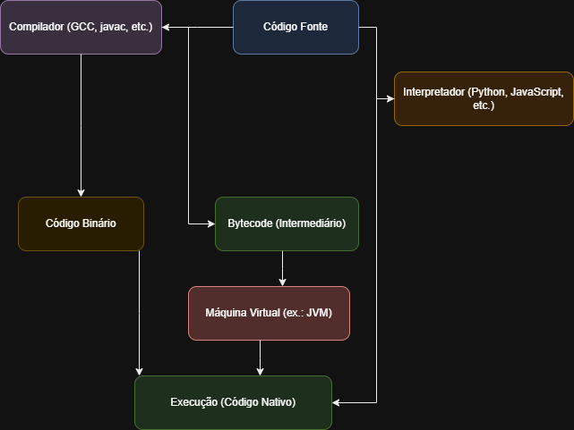

# Desafio 02 – Ambientes de Programação

## 🎯 Objetivo

Explicar os componentes dos ambientes de programação através de um diagrama autoral, abordando compiladores, interpretadores e máquinas virtuais. A proposta é ilustrar suas funções e diferenças utilizando exemplos práticos.

## 🧠 Desenvolvimento

O diagrama apresentado foi criado com a ferramenta [Draw.io](https://app.diagrams.net), representando de forma clara e didática a interação entre código-fonte, compiladores, interpretadores, máquinas virtuais e a execução final do programa.

### ✅ Definições principais:

- **Compilador:** Transforma o código-fonte em código de máquina antes da execução. Exemplo: `gcc` para C.
- **Interpretador:** Lê e executa o código linha por linha, sem gerar código binário. Exemplo: Python.
- **Máquina Virtual:** Executa bytecode intermediário de forma portátil. Exemplo: JVM para Java.

## 📊 Diagrama Explicativo

> O diagrama mostra três fluxos principais:
> - **Compilação Direta (C):** Código → Compilador → Código de Máquina → Sistema Operacional
> - **Interpretação Direta (Python):** Código → Interpretador → Execução
> - **Compilação para Bytecode (Java):** Código → Compilador → Bytecode → Máquina Virtual (JVM) → Execução

## 💡 Exemplos de Linguagens por Abordagem

| Tipo             | Linguagens                   |
|------------------|------------------------------|
| Compiladas       | C, C++, Rust, Go             |
| Interpretadas    | Python, Ruby, JavaScript     |
| Bytecode + VM    | Java, C#, Kotlin             |

## 📚 Referências

- Sebesta, R. W. *Conceitos de Linguagens de Programação*.
- https://docs.oracle.com/javase/specs/
- https://learn.microsoft.com/en-us/dotnet/standard/clr/
- https://realpython.com/python-interpreter/
